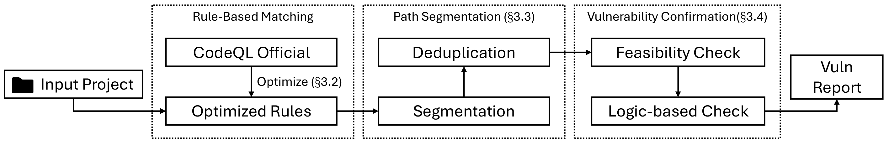
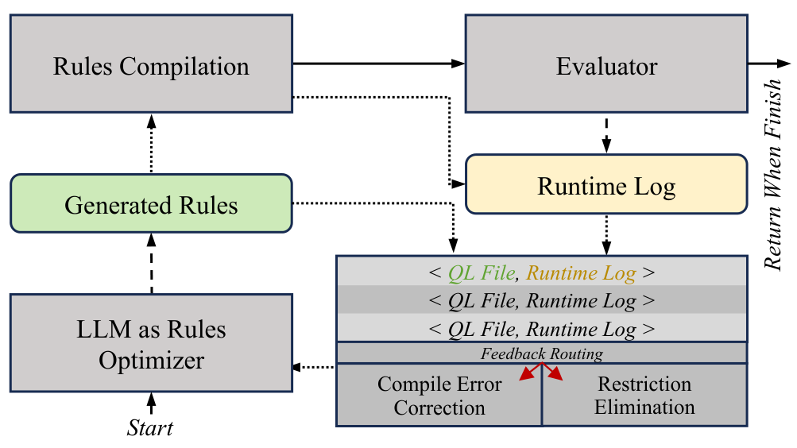

# SEVDF

**Semantic-Enhanced Vulnerability Detection Framework**

Code accompanying [Reframing Paths as Logic: Semantic Segmentation for Vulnerability Detection](https://doi.org/10.1145/3798272).
This repository releases the **AOPRO-QL training code** and **core semantic
segmentation code**.

## Method

### Overall Design



1. **Discover paths.** AOPRO-QL refines CodeQL queries using compilation and
   benchmark feedback; CodeQL extracts candidate source-to-sink paths.
2. **Merge shared logic.** Split paths into backward, intermediate, and forward
   segments. Group segments with matching call traces and compatible contexts
   into Logic Units, retaining propagation variants and constraints.
3. **Reason over units.** Analyze Logic Units with CFG constraints and retrieved
   code context. Intermediate analysis combines the surrounding backward and
   forward summaries.
4. **Reconstruct paths.** Reuse unit-level results across the original paths to
   assess feasibility and vulnerability conditions.

### AOPRO



## Reference

If you use SEVDF in your research, please cite:

```bibtex
@article{cao2026sevdf,
  author  = {Cao, Zong and Sun, Yuqiang and Xu, Zhengzi and Li, Kaixuan and
             Fu, Yeqi and Zhang, Yiran and Kong, Ziqiao and Liu, Yang},
  title   = {Reframing Paths as Logic: Semantic Segmentation for Vulnerability Detection},
  journal = {Proceedings of the ACM on Programming Languages},
  year    = {2026},
  volume  = {10},
  number  = {OOPSLA1},
  pages   = {1989--2016},
  doi     = {10.1145/3798272},
  url     = {https://doi.org/10.1145/3798272}
}
```

## License

[MIT License](LICENSE).
